# 🚀 Capgemini Exceller 20-Day Master Placement Strategy & Roadmap

Welcome to your personalized **Capgemini Exceller On-Campus Placement Preparation System**. 
With **20 days** remaining, our preparation must be laser-focused, structured, and targeted specifically toward Capgemini's exact test patterns (Aon/CoCubes platform), scoring weightages, and elimination checkpoints.

---

## 📊 Overview of the Capgemini Exceller Selection Process

| Round | Component | Questions / Tasks | Time Allotted | Elimination? | Key Focus Areas |
| :--- | :--- | :--- | :--- | :--- | :--- |
| **Round 1.1** | Technical MCQs + Pseudocode | 40 Questions | 40–50 mins | **CRITICAL** (High Cutoff) | Bitwise logic, recursion tracing, loops, OOPs, DBMS, OS, Data Structures |
| **Round 1.2** | English / Communication | 30 Questions | 30 mins | **Yes** | Grammar, sentence correction, vocab, prepositions, reading comprehension |
| **Round 1.3** | Game-Based Cognitive Test | 4 Interactive Games | 20–30 mins | **Yes** | Working memory, deductive reasoning, planning speed, spatial awareness |
| **Round 1.4** | Behavioral / PowerSkills | Scenarios | 20–25 mins | Profile Matching | Situational Judgement Tests (SJT), Capgemini 7 Core Values consistency |
| **Round 2** | Coding Assessment | 2 Coding Problems | 45 mins | **CRITICAL** | Arrays, Strings, HashMaps, Math, Two Pointers, Matrix (Medium level) |
| **Round 3** | Technical Interview | 1-on-1 Interview | 20–35 mins | **Yes** | Resume projects, Core CS (OOPs/DBMS/OS), live coding & dry running |
| **Round 4** | HR Interview | 1-on-1 Interview | 10–20 mins | Final Selection | STAR behavioral questions, company background, cultural fit, shift flexibility |

---

## 🗓️ 20-Day Phase-by-Phase Preparation Schedule

```mermaid
gantt
    title Capgemini 20-Day Preparation Timeline
    dateFormat  X
    axisFormat Day %d
    section Phase 1: Foundations
    Pseudocode & Core CS MCQs        :active, p1, 0, 5
    section Phase 2: Coding Mastery
    Coding Round (Medium DSA & Strings) :p2, 5, 10
    section Phase 3: Cognitive & Verbal
    Game Cognitive + English + SJT  :p3, 10, 14
    section Phase 4: Full Mocks
    Full Timed OA Simulations      :p4, 14, 17
    section Phase 5: Interview Prep
    Tech Deep-Dive & HR Mock Scripts:p5, 17, 20
```



---

### 🟢 Phase 1: Pseudocode & Core CS MCQs (Days 1 – 5)
> **Goal:** Secure full marks in the highest elimination section of Round 1.
- **Day 1: Pseudocode Fundamentals**
  - Bitwise operations: `&`, `|`, `^` (XOR), `~` (NOT), `<<`, `>>`
  - Operator precedence, short-circuit evaluation in `AND`/`OR`
  - Variable scoping and pass-by-reference vs pass-by-value in pseudocode
- **Day 2: Pseudocode Tracing (Loops & Recursion)**
  - Nested `for` and `while` loop iterations and termination conditions
  - Recursion call stacks, base cases, and return value accumulation
  - Solving 30+ actual previous Capgemini pseudocode questions
- **Day 3: Core CS – Object-Oriented Programming (OOPs)**
  - 4 Pillars: Encapsulation, Abstraction, Inheritance, Polymorphism (Compile-time vs Run-time)
  - Constructors/destructors execution order, virtual functions, abstract classes, interfaces
  - Diamond problem, static members, access specifiers
- **Day 4: Core CS – DBMS & SQL**
  - Relational model, Keys (Primary, Foreign, Candidate, Super)
  - Normalization (1NF, 2NF, 3NF, BCNF) with anomaly examples
  - ACID properties, Transactions, Concurrency control
  - SQL Queries: `JOIN`s, Subqueries, `GROUP BY ... HAVING`, Second Highest Salary
- **Day 5: Core CS – Operating Systems & Data Structures MCQs**
  - OS: Process vs Thread, CPU Scheduling (FCFS, SJF, Round Robin), Deadlock (Coffman conditions, Bankers algo), Paging & Virtual Memory
  - DS MCQs: Binary Tree traversals, BST properties, Graph representations, Stack & Queue applications, Time & Space complexities

---

### 🔵 Phase 2: Coding Round Preparation (Days 6 – 10)
> **Goal:** Ensure you can solve both coding questions within 45 minutes with 100% test cases passed.
- **Day 6: Array & Math Fundamentals**
  - Frequency counting, prefix sums, sub-array sums
  - Number theory: Prime checks (Sieve of Eratosthenes), GCD/LCM, palindrome numbers, base conversion
- **Day 7: String Manipulation & Pattern Matching**
  - Anagrams, palindrome substring, character replacement, string compression
  - Word reversal, substring matching without built-ins
- **Day 8: Two Pointers & Sliding Window Techniques**
  - Pair sum problems, removing duplicates in-place
  - Longest substring without repeating characters, minimum window concepts
- **Day 9: HashMaps, Sets & Sorting Algorithms**
  - Finding elements with specific frequencies, first non-repeating element
  - Custom comparator sorting, dry run of QuickSort / MergeSort logic
- **Day 10: Matrix & Recursion Problems**
  - Matrix rotation, spiral traversal, diagonal sums
  - Basic backtracking & recursion: subset generation, permutation count

---

### 🟡 Phase 3: Game-Based Cognitive, English & PowerSkills (Days 11 – 14)
> **Goal:** Ace the Aon/CoCubes unique gamified cognitive battery and verbal test.
- **Day 11: Game Cognitive – Switch Challenge & Digit Challenge**
  - **Switch Challenge**: Decoding 4-digit symbol operators and sequence transformations under time pressure
  - **Digit Challenge**: Fast mental arithmetic, operations under constraints
- **Day 12: Game Cognitive – Grid Challenge & Motion Challenge**
  - **Grid Challenge**: Dual-task memory test (memorizing dot coordinates while evaluating shape symmetry)
  - **Motion Challenge**: Ball/slider puzzle optimizing minimal move paths
  - **Inductive / Deductive Game**: Finding sequence patterns and odd-one-out
- **Day 13: English / Communication Test**
  - Spotting errors in subject-verb agreement, tenses, prepositions
  - Sentence rearrangement / Para-jumbles strategy
  - Vocabulary, synonyms/antonyms, contextual words
  - Reading comprehension skimming techniques
- **Day 14: Behavioral / PowerSkills (Situational Judgement Test)**
  - Understanding Capgemini's 7 Core Values: **Honesty, Boldness, Trust, Freedom, Fun, Modesty, Team Spirit**
  - Solving scenario-based questions: workplace ethics, conflict resolution, deadlines, teamwork
  - Maintaining consistency (answering correlated questions identically)

---

### 🟣 Phase 4: Full-Length Mocks & Speed Drills (Days 15 – 17)
> **Goal:** Build stamina, calibrate pacing, and eliminate test anxiety.
- **Day 15: Mock Online Assessment 1**
  - Timed test: 40 MCQs/Pseudocode (45m) + English (30m)
  - Immediate review of missed questions and gap analysis
- **Day 16: Mock Online Assessment 2 + Coding Speed Drill**
  - Timed 45-minute 2-question coding session
  - Review edge cases: empty inputs, integer overflow, constraints ($10^5$ vs $10^9$)
- **Day 17: Mock Online Assessment 3 (Cognitive + Technical Combo)**
  - Full simulation under strict timed conditions

---

### 🔴 Phase 5: Technical & HR Interview Masterclass (Days 18 – 20)
> **Goal:** Convert your written test success into a final offer letter.
- **Day 18: Resume & Project Deep-Dive**
  - Structuring your primary project using the **STAR Method** (Situation, Task, Action, Result)
  - Preparing for architecture questions: database schema, APIs, why this tech stack over another?
  - Anticipating "What was the biggest technical bug/challenge you faced?"
- **Day 19: Technical Interview Questions & Live Code Explanation**
  - How to explain code while writing it in front of the interviewer
  - Common live questions: reverse linked list, detect cycle, OOPs real-world analogy, SQL join queries
  - Recent trends: Cloud basics, Generative AI awareness, Microservices overview
- **Day 20: HR Interview Polish & Final Readiness**
  - "Tell me about yourself" (60-second elevator pitch customized for Capgemini)
  - "Why Capgemini?", "Where do you see yourself in 3 years?"
  - Readiness for night shifts, relocations, service agreements
  - Questions you MUST ask the interviewer at the end

---

## 🗂️ Prepared Workspace Structure

We will organize all materials cleanly in your workspace:
```
Capgemini Prep/
│
├── 00_20_DAY_MASTER_ROADMAP.md             <-- (This master guide)
│
├── 01_Technical_MCQ_and_Pseudocode/
│   ├── Pseudocode_Rules_and_Tricks.md
│   ├── Pseudocode_Practice_Questions.md
│   ├── OOPs_High_Yield_Notes.md
│   ├── DBMS_and_SQL_High_Yield_Notes.md
│   └── OS_and_DataStructures_MCQs.md
│
├── 02_Coding_Round/
│   ├── Capgemini_Top_50_Coding_Patterns.md
│   └── Solutions/ (C++, Java, Python implementations)
│
├── 03_Game_Based_Cognitive/
│   ├── Switch_Challenge_Strategy.md
│   ├── Grid_Challenge_Memory_Hacks.md
│   ├── Motion_Challenge_Guide.md
│   └── Digit_Challenge_Shortcuts.md
│
├── 04_English_and_PowerSkills/
│   ├── Grammar_Rules_CheatSheet.md
│   └── PowerSkills_SJT_Capgemini_Values.md
│
└── 05_Interview_Prep/
    ├── Resume_Project_Scripting_STAR.md
    ├── Top_Technical_Interview_Questions.md
    └── HR_Interview_Questions_and_Sample_Answers.md
```
